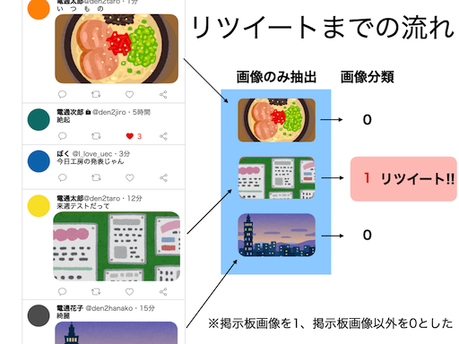

#UECBBS
@uec\_bbsのタイムライン上に流れてきた電気通信大学の掲示板画像を自動で画像分類し、リツイートするbotです。 



## Twitter
アカウント: @uec\_bbs  
URL: [https://twitter.com/uec_bbs](https://twitter.com/uec_bbs)

## 分類器
掲示板画像とそれ以外の画像との2クラス分類として学習させてあります。
モデルはDenseNetでその特徴量から近似最近傍探索を行っています。

DenseNetはGistにある以下のコードを使用しています。  
[Implementation of DenseNet with Keras(TensorFlow)](https://gist.github.com/A03ki/27ec0cec5aed24c335dcd463350b5041)

## Twissify
Tweepyで取得したツイートの画像分類を助けるために整備しているPythonパッケージです。  
@uec\_bbsは一部の処理でtwissifyを使用しています。

### インストール

```
python setup.py install
```
